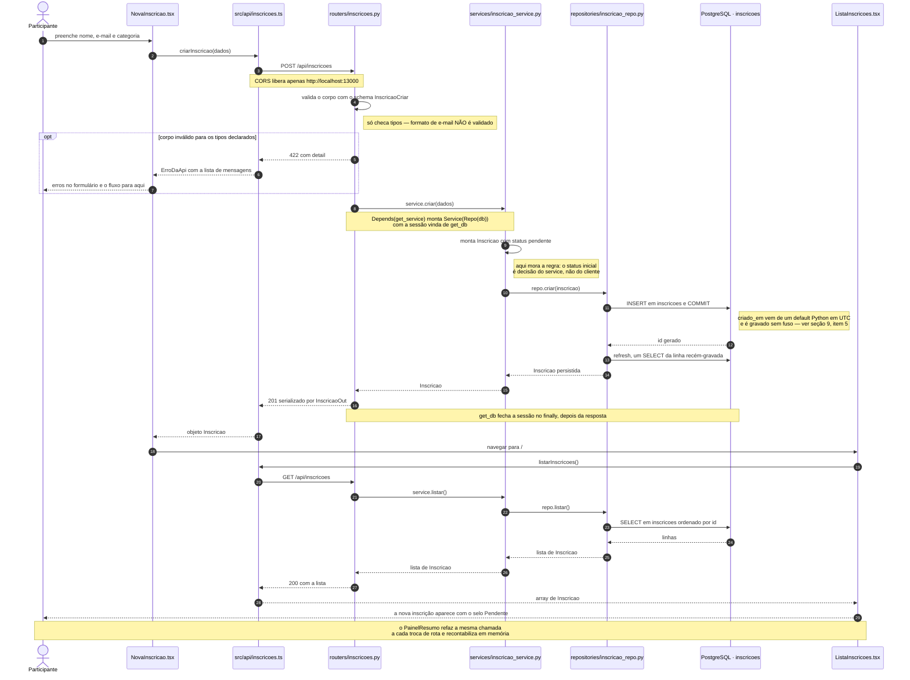

# Onboarding · DevConf Vertigo 2026 — Sistema de Inscrições

Guia para quem chega no projeto sem ninguém do time original disponível.
Levantado lendo o código inteiro e testando a API rodando localmente.

> Convenção do projeto: **PT-BR em código de domínio, mensagens de erro e commits**.
> As regras curtas do time estão em `.claude/CLAUDE.md`; este guia é a versão longa.

---

## 1. O que o sistema faz

Gestão de inscrições do evento DevConf Vertigo 2026:

- o participante se inscreve por um **formulário público** (a inscrição nasce `pendente`);
- a organização move a inscrição por um **ciclo de status** (confirmar, lista de espera, check-in);
- cada inscrição pode ter **acompanhantes**, com restrição alimentar opcional.

É um sistema pequeno e fechado: 2 tabelas, 6 endpoints, 3 telas. Dá para ler
o backend inteiro em uma sentada — recomendo fazer isso antes da primeira task.

Não existe autenticação, autorização, multi-evento nem cancelamento de inscrição.
Se sua task encostar em algum desses temas, é feature nova, não ajuste.

---

## 2. Subir o ambiente

Tudo roda em Docker. **Não é preciso ter Python nem Node na máquina.**

```bash
./scripts/warmup.sh     # sobe tudo, espera a API, roda a suíte de testes
```

| Serviço    | URL / acesso                                        |
|------------|-----------------------------------------------------|
| API        | http://localhost:18000 — docs interativas em `/docs` |
| Web        | http://localhost:13000                               |
| PostgreSQL | localhost:55432 · usuário/senha/base: `devconf`      |

O código de `backend/` e `frontend/` é **montado nos containers** (bind mount) com
hot-reload: você edita local e o serviço recarrega sozinho. Não precisa rebuildar
para mudar código — só para mexer em dependências (`pyproject.toml`, `package.json`).

### Comandos do dia a dia

```bash
# Testes (SQLite in-memory, roda em ~0.1s)
docker compose exec -T api uv run pytest -q

# Recriar o banco do zero com o seed (destrói os volumes)
./scripts/reset-db.sh

# Nova migration a partir dos models
docker compose exec -T api uv run alembic revision --autogenerate -m "descricao em pt-br"
docker compose exec -T api uv run alembic upgrade head

# Logs
docker compose logs -f api
docker compose logs -f web

# SQL direto
docker compose exec -T db psql -U devconf -d devconf -c "SELECT * FROM inscricoes;"
```

Na subida, o container da API roda em sequência: `alembic upgrade head` →
`python -m app.seed` → `uvicorn --reload`. O seed é **idempotente** (sai cedo se já
houver qualquer inscrição), então reiniciar não duplica dados.

---

## 3. Mapa do repositório

```
backend/
  app/
    main.py              # cria o FastAPI, CORS, registra routers, /health
    db.py                # engine, SessionLocal, Base, get_db (dependency)
    models/              # SQLAlchemy 2.0 (Mapped/mapped_column) — tabelas
    schemas/             # Pydantic v2 — contratos de entrada/saída da API
    routers/             # HTTP: rota, status code, tradução de exceção → HTTP
    services/            # REGRA DE NEGÓCIO (é aqui que quase tudo acontece)
    repositories/        # acesso a dados, sem regra de negócio
    seed.py              # carga inicial de 19 inscrições + 3 acompanhantes
  migrations/            # Alembic (uma migration inicial até agora)
  tests/                 # pytest — conftest.py monta o client de teste
frontend/
  src/api/inscricoes.ts  # única camada que fala com a API + tipos TS
  src/pages/             # ListaInscricoes, NovaInscricao, DetalheInscricao
  src/components/        # PainelResumo, StatusBadge
  src/styles/            # tokens.css (design tokens Vertigo) + global.css
scripts/                 # warmup.sh, reset-db.sh
.claude/                 # convenções + automações de review (ver seção 8)
```

---

## 4. O domínio

### Modelo de dados

**`inscricoes`** — `backend/app/models/inscricao.py`

| Campo            | Tipo          | Observação                                |
|------------------|---------------|-------------------------------------------|
| `id`             | int, PK       |                                           |
| `nome_completo`  | String(120)   | NOT NULL, mas **string vazia é aceita**   |
| `email`          | String(120)   | NOT NULL, **sem validação de formato**    |
| `categoria`      | enum          | `participante`, `palestrante`, `vip`, `imprensa` |
| `status`         | enum          | default `pendente`                        |
| `criado_em`      | DateTime      | default `datetime.now(timezone.utc)` — coluna **sem timezone**, grava naive |

**`acompanhantes`** — `backend/app/models/acompanhante.py`

| Campo                  | Tipo                | Observação                     |
|------------------------|---------------------|--------------------------------|
| `id`                   | int, PK             |                                |
| `inscricao_id`         | int, FK → inscricoes|                                |
| `nome`                 | String(120)         |                                |
| `restricao_alimentar`  | String(120), null   | opcional                       |

A relação é `Inscricao.acompanhantes` com `cascade="all, delete-orphan"` — apagar a
inscrição apaga os acompanhantes.

> **Detalhe de import:** os dois models se importam mutuamente no **final** do arquivo
> (`from app.models.acompanhante import Acompanhante  # noqa: E402`). É o contorno de
> import circular que permite as anotações `Mapped["Acompanhante"]`. Não mova esses
> imports para o topo — quebra a carga dos models.

### Máquina de estados (o coração da regra de negócio)

`TRANSICOES_VALIDAS` em `backend/app/services/inscricao_service.py:7`:

```
pendente ────────► confirmada ────────► check_in_feito  (terminal)
    │                  ▲
    │                  │
    └──► lista_de_espera
```

| De                | Para permitido                    |
|-------------------|-----------------------------------|
| `pendente`        | `confirmada`, `lista_de_espera`   |
| `lista_de_espera` | `confirmada`                      |
| `confirmada`      | `check_in_feito`                  |
| `check_in_feito`  | — (nada, é terminal)              |

Qualquer outra transição levanta `TransicaoInvalida` (`services/excecoes.py`), que o
router traduz para **HTTP 409** com mensagem em PT-BR.

Consequências que costumam surpreender:

- **Não existe volta atrás.** Confirmou, não desconfirma. Errou o check-in, só no SQL.
- **Não existe cancelamento.** Não há status para isso.
- **Repetir o status atual é 409** (`pendente → pendente` é inválido, pois `pendente`
  não está no próprio conjunto de destinos).
- O `select` da tela de detalhe oferece os 4 status, inclusive os inválidos para o
  estado corrente — o usuário descobre o erro pelo 409 que aparece na tela. É o
  comportamento atual, não um bug de front.

### Endpoints

| Método  | Rota                                          | O que faz                              |
|---------|-----------------------------------------------|----------------------------------------|
| `GET`   | `/health`                                     | liveness (`{"status":"ok"}`)           |
| `GET`   | `/api/inscricoes`                             | lista todas, ordenadas por id          |
| `POST`  | `/api/inscricoes`                             | cria (sempre nasce `pendente`) → 201   |
| `GET`   | `/api/inscricoes/{id}`                        | detalhe + `total_acompanhantes`        |
| `PATCH` | `/api/inscricoes/{id}/status`                 | muda status → 409 se inválido          |
| `GET`   | `/api/inscricoes/{id}/acompanhantes`          | lista acompanhantes da inscrição       |
| `POST`  | `/api/inscricoes/{id}/acompanhantes`          | adiciona acompanhante → 201            |

Explore em http://localhost:18000/docs.

---

## 5. Arquitetura em camadas — a regra que não se negocia

```
routers/  →  services/  →  repositories/  →  banco
  HTTP        negócio         dados
```

- **`routers/`**: recebe, chama o service, devolve. Traduz exceção de negócio em
  `HTTPException`. **Nenhum `if` de regra de negócio aqui.**
- **`services/`**: **toda** regra de negócio. Valida, decide, orquestra.
- **`repositories/`**: query e persistência. Nada de decisão.

O service recebe o repo por injeção no construtor, e o router monta os dois numa
dependency `get_service` (ex.: `routers/inscricoes.py:17`). É esse desenho que deixa o
service testável isolado.

### O fluxo de ponta a ponta

Uma inscrição nova, do clique no formulário React até a linha no Postgres e a volta
para a tela de lista. Se você entender este caminho, entendeu o sistema inteiro —
todos os outros endpoints são variações dele.



Três coisas para reparar no desenho:

- **o status inicial nunca vem do cliente.** `InscricaoCriar` não tem campo `status`;
  quem decide `pendente` é o service. Mudanças de status só pelo `PATCH`;
- **o router não toca no banco e o repo não decide nada.** O caminho é sempre
  router → service → repo, em ambas as direções;
- **a sessão vive por requisição.** `get_db` abre no início e fecha no `finally`, e o
  `commit` acontece dentro do repositório — não no service nem no router.

### Receita: adicionar um endpoint novo

Siga a ordem, é a que o código existente usa:

1. **Schema** em `schemas/` — o contrato Pydantic de entrada e/ou saída.
2. **Repositório** em `repositories/` — se precisar de uma query nova.
3. **Service** em `services/` — a regra. Se for um erro de negócio, crie uma exceção
   em `services/excecoes.py` com mensagem em PT-BR.
4. **Router** em `routers/` — a rota, o `response_model`, o `status_code` e o
   `try/except` que mapeia a exceção nova para o HTTP certo.
5. **Teste** em `tests/` — usando a fixture `client` do conftest.
6. **Migration**, se mexeu em model: `alembic revision --autogenerate -m "..."`.

Se sua mudança não encosta em `services/`, vale desconfiar: ou é ajuste de
apresentação, ou a regra foi parar no lugar errado.

---

## 6. Frontend

React 18 + TypeScript + Vite, sem biblioteca de estado nem de data-fetching — `useState`
+ `useEffect` + `fetch`. Três telas e dois componentes; a escala do projeto não pede mais.

- **`src/api/inscricoes.ts`** é o **único** ponto que fala com a API. Todos os tipos
  (`Inscricao`, `Status`, `Categoria`…) espelham os schemas do backend à mão — mudou o
  schema no Python, atualize aqui. Erros viram `ErroDaApi`, que já achata o array
  `detail` de erro de validação do FastAPI numa lista de mensagens.
- **`StatusBadge.tsx`** exporta `ROTULOS` (o mapa status → texto PT-BR). Reaproveite em
  vez de reescrever os rótulos.
- Cores de status vêm de CSS custom properties: `var(--cor-status-lista-de-espera)`
  (underscore vira hífen). Definidas em `src/styles/tokens.css`.
- **`PainelResumo`** recarrega a lista completa a cada mudança de rota (via `useLocation`)
  e conta em memória. Não existe endpoint de agregação.
- `vite.config.ts` usa `watch: { usePolling: true }` de propósito: bind mount do Docker
  no Windows não propaga inotify. Não remova sem testar em Windows.
- A URL da API sai de `VITE_API_URL`, com fallback `http://localhost:18000`.

**CORS**: `main.py` libera **apenas** `http://localhost:13000`. Se abrir o front em
outra porta/host, o navegador bloqueia as chamadas — o sintoma é erro de rede no
console com a API respondendo 200 no curl.

---

## 7. Testes

```bash
docker compose exec -T api uv run pytest -q     # 5 testes, ~0.1s
```

Estado hoje: **5 testes, todos passando** (4 de inscrições, 1 de acompanhantes).

`tests/conftest.py` monta o ambiente: SQLite **in-memory** com `StaticPool`,
`create_all` do metadata (não roda Alembic), carrega o mesmo `seed.py` de produção e
sobrescreve a dependency `get_db` do FastAPI. Cada teste ganha um banco limpo.

**Regra do time: use a fixture `client` do conftest. Não crie engine própria no teste.**

Duas implicações de usar SQLite nos testes:

- o **seed é o fixture** — os testes dependem dele (ex.: "a inscrição 1 está pendente").
  Mexer na ordem da lista `INSCRICOES` em `seed.py` quebra testes;
- SQLite **não impõe foreign key** por padrão, Postgres impõe. Um bug de FK pode passar
  verde no pytest e estourar 500 no ambiente rodando. Foi exatamente o que aconteceu com
  o item 4 da seção 9.

Não há testes de frontend nem linter/formatter configurado (sem ruff, sem eslint).

---

## 8. Convenções e automações do time (`.claude/`)

- **`.claude/CLAUDE.md`** — as regras curtas: camadas, PT-BR, comandos.
- **`.claude/agents/revisor.md`** — subagente revisor: confere camadas, routers finos,
  PT-BR e testes. Só lê, não edita.
- **`.claude/commands/revisar.md`** — comando `/revisar`: revisa o diff atual contra as
  convenções e devolve ✅/⚠️/❌ com arquivo:linha.
- **`.claude/hooks/pre_commit_pytest.sh`** — hook `PreToolUse` em Bash: intercepta
  qualquer comando com `git commit` e **bloqueia o commit se o pytest estiver vermelho**.
  Se o ambiente Docker estiver parado, o hook também bloqueia — a mensagem manda rodar
  `./scripts/warmup.sh`. Não é bug, é o hook fazendo o trabalho dele.

**Commits** seguem Conventional Commits com descrição em PT-BR sem acento:
`feat: frontend de inscricoes (lista, formulario e detalhe)`,
`fix: usa datetime.now(timezone.utc) no default de criado_em`.

---

## 9. Armadilhas conhecidas (verificadas contra a API rodando)

Isto não é especulação — cada item abaixo foi reproduzido com `curl` no ambiente local
em 18/08/2026. São dívidas reais do projeto; provavelmente algumas viram suas primeiras
tasks.

**1. Recurso inexistente devolve 500, não 404.**
`InscricaoRepo.buscar_por_id` retorna `Inscricao | None`, mas
`InscricaoService.obter_detalhe` e `mudar_status` usam o retorno sem checar `None`.

```
GET   /api/inscricoes/99999          → HTTP 500 Internal Server Error
PATCH /api/inscricoes/99999/status   → HTTP 500 Internal Server Error
```

Correção certa: uma exceção `InscricaoNaoEncontrada` em `services/excecoes.py`, levantada
no **service**, mapeada para 404 no router. Nenhum teste cobre esse caminho hoje.

**2. Nenhuma validação de entrada na criação.**
`InscricaoCriar` declara `nome_completo: str` e `email: str` — sem `EmailStr`, sem
tamanho mínimo. Isso passa:

```
POST /api/inscricoes  {"nome_completo":"","email":"isso-nao-e-email",...}  → HTTP 201
```

`pydantic[email]` **já está** nas dependências, então trocar para `EmailStr` é barato.
Atenção: o seed tem registros sujos de propósito (uma inscrição com nome vazio e a
"Mônica Lima" com email sem `@`) — provavelmente para exercitar o fallback `(sem nome)`
das telas. Se apertar a validação, decida o que fazer com esses registros e com os dados
já gravados.

**3. Acompanhante em inscrição inexistente devolve 500.**
`AcompanhanteService.adicionar` não verifica se a inscrição existe; a FK do Postgres
estoura no commit.

```
POST /api/inscricoes/99999/acompanhantes  → HTTP 500
```

E note que **passa nos testes**, porque o SQLite do pytest não impõe FK.

**4. Listar acompanhantes de inscrição inexistente devolve `200 []`.**
Inconsistente com o resto — deveria ser 404. Verificado.

**5. `criado_em` é gravado naive.** O default calcula em UTC (`datetime.now(timezone.utc)`),
mas a coluna é `DateTime` sem `timezone=True`, então o offset é descartado na gravação e
a API devolve o timestamp sem fuso. O front faz `new Date(iso)`, que interpreta string
sem fuso como **horário local** — some/aparece diferença de fuso na data exibida. Corrigir
exige migration (`DateTime(timezone=True)`) + decisão sobre os dados existentes.

**6. Tipos do front são cópia manual dos schemas.** Não há geração a partir do OpenAPI.
Mudou o backend, atualize `src/api/inscricoes.ts` na mesma PR — o TypeScript não avisa.

**7. `frontend/Dockerfile` copia só `package.json`, sem lockfile**, e roda `npm install`.
Builds em máquinas diferentes podem resolver versões diferentes.

---

## 10. Sugestão de primeiros passos

1. `./scripts/warmup.sh` e confira as três URLs da seção 2.
2. Clique pelas três telas: liste, crie uma inscrição, abra o detalhe, tente uma
   transição inválida e veja o 409 aparecer.
3. Leia, nesta ordem: `models/inscricao.py` → `services/inscricao_service.py` →
   `routers/inscricoes.py` → `tests/test_inscricoes.py`. São ~150 linhas e cobrem o
   desenho inteiro.
4. Como primeira contribuição, o **item 1 da seção 9** (404 em vez de 500) é ideal:
   toca as três camadas na ordem canônica, exige exceção nova em PT-BR e pede testes —
   ou seja, você pratica a receita da seção 5 inteira num escopo pequeno.
5. Antes de commitar, rode `/revisar` (ou chame o subagente `revisor`). O hook de
   pre-commit vai rodar o pytest de qualquer forma.

---

## 11. Estado da documentação

O `README.md` foi conferido contra o código rodando e **corrigido** (18/08/2026).
Hoje ele reflete a realidade: domínio completo, as 7 rotas, ciclo de status,
`reset-db.sh`, seed, hook de pre-commit e a pegadinha de CORS.

Fica o registro do que estava errado, porque explica **como** a documentação
desandou — e o padrão pode se repetir:

- a descrição do domínio dizia "ciclo de aprovação simples (pendente → confirmada)",
  escondendo 2 dos 4 status e a entidade acompanhantes inteira;
- a tabela de Endpoints listava **2 das 7 rotas**, sem o `PATCH` de status — que é a
  regra de negócio central do sistema.

A causa não foi deriva gradual. O commit `848f45c` ("docs: enxuga o README para o
essencial de operacao", 15/07/2026) trocou, num só passo, uma frase que **já era
correta** por uma versão simplificada e errada, e criou a tabela de Endpoints já
incompleta — a API completa existia desde `06f38d8`, do dia anterior. Enxugar era um
objetivo legítimo, mas o corte atingiu o único registro daquelas informações.

**Lição para o time:** ao enxugar documentação, confira se o conteúdo cortado existe
em outro lugar. O que só está no README não é redundância — é a fonte.

Ainda vale saber que o `.claude/CLAUDE.md` continua sem citar `reset-db.sh`, o seed e
o hook de pre-commit. Isso é aceitável (ele é um cartão de convenções, não um manual),
desde que o README e este guia cubram o assunto — como cobrem agora.

---

## Perguntas em aberto para o time / product owner

Coisas que o código não responde e que eu não tinha a quem perguntar:

- Inscrição **cancelada** deveria existir como status? Hoje não há como sair do fluxo.
- Alguma transição precisa de **volta atrás** (desconfirmar, desfazer check-in)?
- **Duplicidade de e-mail** deveria ser bloqueada? Hoje não há unique constraint nem
  checagem no service.
- Existe **limite de vagas**? `lista_de_espera` sugere que sim, mas nada no código o
  aplica — a transição para lista de espera é manual.
- Há **limite de acompanhantes** por inscrição, ou regra por categoria (VIP, imprensa)?
- O sistema vai precisar de **autenticação**? Hoje o PATCH de status é público — qualquer
  um com a URL confirma qualquer inscrição.
